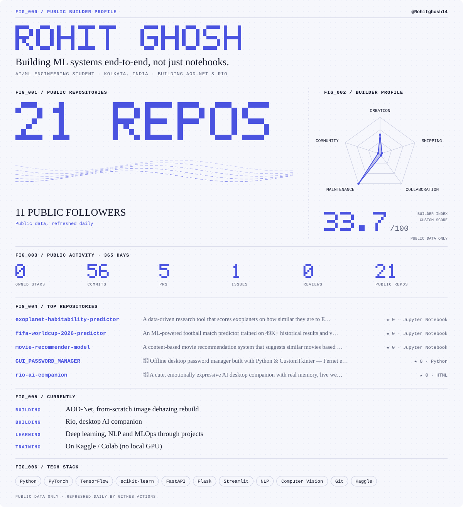

<a href="https://github.com/Rohitghosh14?tab=repositories">
<picture>
  <source media="(max-width: 600px) and (prefers-color-scheme: dark)" srcset="./assets/public-builder-profile-mobile-dark.svg" />
  <source media="(max-width: 600px)" srcset="./assets/public-builder-profile-mobile.svg" />
  <source media="(prefers-color-scheme: dark)" srcset="./assets/public-builder-profile-dark.svg" />
  
</picture>
</a>

[LinkedIn](https://www.linkedin.com/in/rohit-ghosh14) · [Kaggle](https://www.kaggle.com/rohitghosh14) · [Email](mailto:rohitghosh1214@gmail.com)

[All repositories](https://github.com/Rohitghosh14?tab=repositories) · [All merged contributions](https://github.com/search?q=author%3ARohitghosh14+is%3Apr+is%3Amerged+is%3Apublic+-user%3ARohitghosh14&type=pullrequests)

### 📂 Featured Projects

| Project | Description |
| --- | --- |
| [Exoplanet Habitability Predictor](https://github.com/Rohitghosh14/exoplanet-habitability-predictor) | NASA TAP API data, custom ESI metric, SVM + Random Forest, Streamlit app |
| [FIFA World Cup 2026 Predictor](https://github.com/Rohitghosh14/fifa-worldcup-2026-predictor) | Feature engineering + Random Forest, validated against real 2026 results |
| [Content-Based Movie Recommender](https://github.com/Rohitghosh14/movie-recommender-model) | CountVectorizer + cosine similarity, Streamlit UI |
| [GUI Password Manager](https://github.com/Rohitghosh14/GUI_PASSWORD_MANAGER) | CustomTkinter, Fernet encryption, PBKDF2HMAC |
| [Rio — Desktop AI Companion](https://github.com/Rohitghosh14/rio-ai-companion) | AI desktop pet app |

### 🐍 Contribution Snake

<picture>
  <source media="(prefers-color-scheme: dark)" srcset="https://raw.githubusercontent.com/Rohitghosh14/Rohitghosh14/output/github-contribution-grid-snake-dark.svg" />
  
</picture>

Public statistics refresh automatically every day. <a href="./RANKING.md">Sources and methodology</a>.
