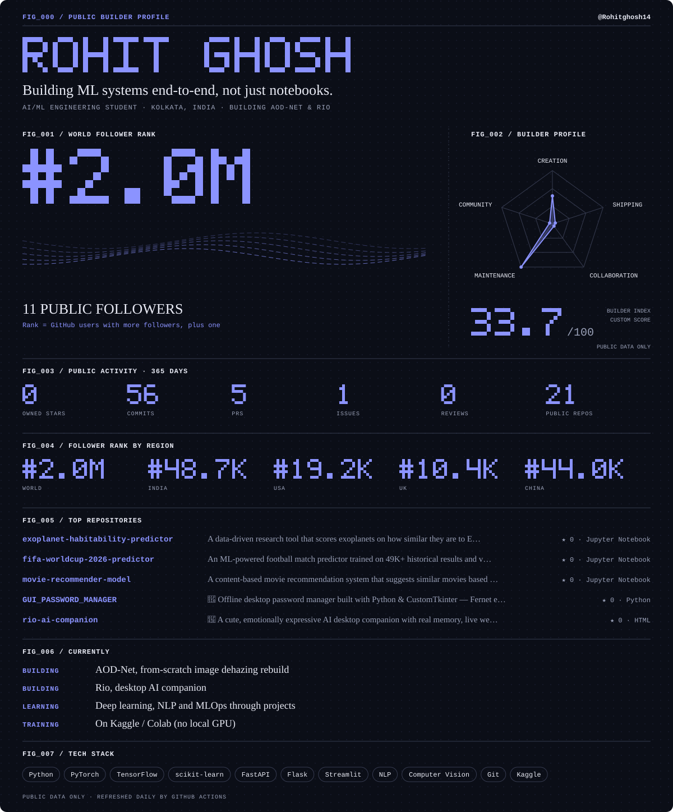

<a href="./assets/public-builder-profile.svg#gh-light-mode-only">
<picture>
  <source media="(max-width: 600px)" srcset="./assets/public-builder-profile-mobile.svg" />
  
</picture>
</a>
<a href="./assets/public-builder-profile-dark.svg#gh-dark-mode-only">
<picture>
  <source media="(max-width: 600px)" srcset="./assets/public-builder-profile-mobile-dark.svg" />
  
</picture>
</a>

[LinkedIn](https://www.linkedin.com/in/rohit-ghosh14) · [Kaggle](https://www.kaggle.com/rohitghosh14) · [Email](mailto:rohitghosh1214@gmail.com)

[All repositories](https://github.com/Rohitghosh14?tab=repositories) · [All merged contributions](https://github.com/search?q=author%3ARohitghosh14+is%3Apr+is%3Amerged+is%3Apublic+-user%3ARohitghosh14&type=pullrequests)

Public statistics refresh automatically every day.

---

### 🐍 Contribution Snake

  
  

